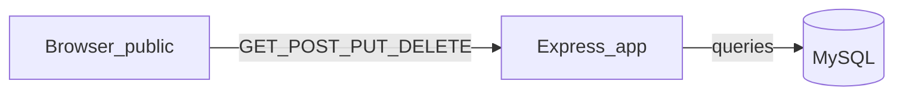

# Plano: front-end de testes para o ConversorDeBases (Lab3)

## Visão do projeto atual

- **Stack**: Node.js, [Express 5](https://expressjs.com/), MySQL via `mysql2`, variáveis em `.env` ([`src/server.js`](src/server.js), [`src/config/db.js`](src/config/db.js)).
- **API REST** montada em [`src/app.js`](src/app.js):
  - **`/users`**: CRUD completo (GET lista, GET `/:id`, POST, PUT/PATCH `/:id`, DELETE `/:id`) — ver [`src/routes/userRoutes.js`](src/routes/userRoutes.js) e [`src/controllers/UserController.js`](src/controllers/UserController.js).
  - **`/conversion-history`**: listagem geral, por usuário (`GET /user/:id`), por id, criação (com conversão e persistência), atualização e exclusão — [`src/routes/conversionHistoryRoutes.js`](src/routes/conversionHistoryRoutes.js), [`src/controllers/ConversionHistoryController.js`](src/controllers/ConversionHistoryController.js).
- **Bases suportadas** (valores numéricos enviados em `fromBase` / `toBase`): **2, 10, 16, 36, 60, 64** — definidas em [`src/enums/NumberBase.js`](src/enums/NumberBase.js). O modelo [`ConversionHistory`](src/models/ConversionHistory.js) serializa JSON com labels enriquecidos (`fromBaseLabel`, etc.).
- **Contratos úteis para o front**:
  - Criar usuário: `POST /users` body `{ name, email }` → `201` + usuário (inclui `id`).
  - Criar conversão: `POST /conversion-history` body `{ userId, inputValue, fromBase, toBase }` → `201` com `resultValue` calculado pelo [`ConversionHistoryService`](src/Services/ConversionHistoryService.js).
  - Erros frequentes: `400` (validação), `404`, `409` (e-mail duplicado), mensagens em português no campo `error`.

Referência de chamadas já documentada de forma prática em [`RoutesCruds.json`](RoutesCruds.json) (Postman).

## Objetivo do front-end

Interface **simples**, **só para testar o backend**, com aparência **cuidadosa** (tipografia, espaçamento, cores coerentes com tema “números/bases”, feedback de carregamento e erros). Escopo sugerido:

1. **Usuários**: listar, criar, editar, excluir (fluxos mínimos com formulários enxutos).
2. **Conversões**: formulário principal (usuário, valor de entrada, bases origem/destino), exibir **resultado** (`resultValue`) e **histórico** (lista global ou filtrada por usuário selecionado).
3. **Operações secundárias** (opcional na primeira entrega): editar/excluir registro de histórico via UI, se quiser paridade total com a API.

## Decisão de arquitetura (recomendada)

| Opção | Prós | Contras |
|--------|------|---------|
| **A) SPA estática servida pelo Express** (`public/`) | Zero build, um único processo, mesmo `PORT` | Precisa ajustar o backend para `express.static` |
| **B) Front em outra porta (Vite, etc.)** | Hot reload forte | CORS obrigatório; dois comandos |

**Recomendação**: **Opção A** — pastas `public/index.html`, `public/css/`, `public/js/`, servidas após as rotas da API (ou com prefixo `/api` para APIs — ver abaixo).

## Ajustes mínimos no backend (necessários para integrar)

1. **`express.static`**: em [`src/app.js`](src/app.js), servir `public` e, em desenvolvimento, entregar `index.html` para `/` (rota GET explícita ou `fallthrough` cuidadoso para não sombrear `/users` e `/conversion-history`).
2. **CORS** (se no futuro usar front separado): `cors` middleware ou headers manuais; para Opção A, CORS pode ser omitido (mesma origem).
3. **(Opcional, recomendado)** Endpoint **`GET /meta/supported-bases`** (ou similar) que retorne `listSupportedBases()` de [`NumberBase.js`](src/enums/NumberBase.js), para o `<select>` do front **não duplicar** a lista de radices. Alternativa sem novo endpoint: constante espelhada no JS do front (mais rápido, menos DRY).

## Estrutura de pastas sugerida

```text
public/
  index.html          # layout: cabeçalho, abas ou seções Usuários | Conversões
  css/styles.css      # variáveis CSS, tema (ex.: fundo escuro + acento)
  js/
    api.js            # base URL, fetchJson, tratamento de erro
    users.js          # CRUD usuários
    conversions.js    # formulário + listagens de histórico
    app.js            # inicialização, navegação entre seções
```

**Base URL da API**: ler de `window.__API_BASE__` injetado em um `<script>` no HTML ou usar caminho relativo `''` se tudo no mesmo host/porta.

## UX / UI (“bonito” e funcional)

- **Tipografia**: uma fonte sans para UI + **monoespaçada** para valores numéricos (`inputValue`, `resultValue`, bases).
- **Layout**: cartões (`card`) com sombra leve, grid responsivo; botões com estados `:disabled` durante `fetch`.
- **Feedback**: mensagens de erro usando `error` do JSON; toasts ou banner inline; loading em botões.
- **Acessibilidade básica**: `label` associado a inputs, foco visível, contraste adequado.
- **Tema alinhado ao projeto**: paleta sóbria (ex. azul/cinza ou âmbar sobre escuro), detalhes em “terminal” só nos números — sem poluir com ícones desnecessários.

## Fluxo de dados (visão geral)



Fluxo de uso típico: criar usuário → selecionar `userId` → preencher conversão → ver `resultValue` → listar histórico (`GET /conversion-history` ou `GET /conversion-history/user/:id`).

## Ordem de implementação sugerida

1. Backend: `static` + rota `GET /` (e opcional `GET /meta/supported-bases`).
2. Esqueleto HTML com duas áreas (Usuários / Conversões) e CSS base.
3. Módulo `api.js` (`fetch`, parsing JSON, mapear `409`/`400` para texto amigável).
4. CRUD de usuários na UI (tabela + modal ou formulário inline).
5. Formulário de conversão + listagem de histórico (refresh após POST).
6. Polimento: validação client-side leve (bases obrigatórias), empty states, README ou comentário no HTML sobre `.env` e MySQL.

## Testes manuais (checklist)

- Subir servidor (`npm run dev`), abrir `http://localhost:PORT/`.
- Criar usuário; tentar e-mail duplicado → ver `409`.
- Converter com `userId` inexistente → `400` com mensagem de FK.
- Bases inválidas (ex. 8) → `400`.
- Listar e filtrar histórico por usuário; conferir `resultValue` com exemplos do [`RoutesCruds.json`](RoutesCruds.json).

## Checklist de tarefas (implementação)

- [ ] Adicionar `express.static` em `public/`, `GET /` para `index.html`, CORS se front separado; opcional `GET /meta/supported-bases` com `listSupportedBases()`
- [ ] Criar `public/index.html` + `css/styles.css` (tema, layout em seções Usuários | Conversões)
- [ ] Implementar `public/js/api.js` (base URL, fetch JSON, erros)
- [ ] Implementar CRUD de usuários em `public/js/users.js` + integração na página
- [ ] Implementar formulário `POST /conversion-history` e listagens `GET` + polish (loading/erros)

## Riscos e mitigação

- **Ordem das rotas Express**: rotas mais específicas (`/conversion-history/user/:id`) já estão antes de `/:id` — manter esse padrão se novas rotas forem adicionadas.
- **Banco offline**: o servidor já encerra se MySQL falhar; o front deve exibir erro genérico se a API não responder.
